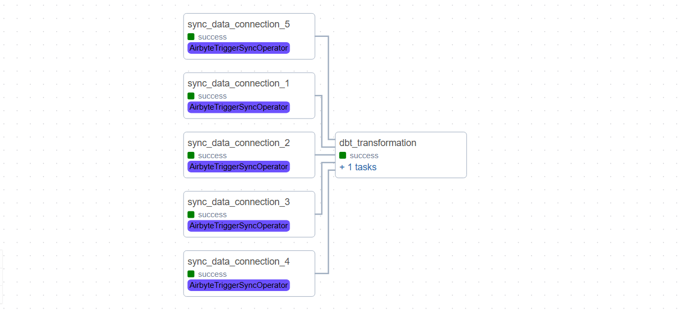
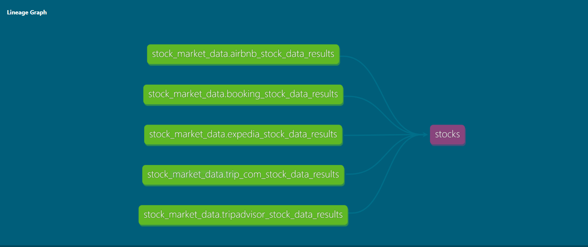

# Project Senario 🗺
This project is an end-to-end ELT pipeline that automates the extraction, loading, and transformation of stock market data for the five largest tourism companies. It leverages Airbyte to extract data from the Polygon API and load it into BigQuery. dbt is used to perform transformations and generate reusable data for analysis, while Airflow orchestrates the entire workflow with daily automation. All services are deployed using Docker.

## Project Flow

## Lineage Graph

## Data dictionary 
- symbol: 
  The stock ticker's symbol (e.g., Airbnb, Booking).
- date: 
  The date for the start of the aggregate window.
- open: 
  The open price for the symbol in the given time period.
- close: 
  The close price for the symbol in the given time period.
- high: 
  The highest price for the symbol in the given time period.
- low: 
  The lowest price for the symbol in the given time period.
- volume: 
  The trading volume of the symbol in the given time period 
- volume_average: 
  The volume weighted average price.
- number_of_transactions: 
  The number of transactions in the aggregate window.

## Data Quality Checks:
1. null values: date
2. accepted values: symbol

#### Next steps:
1. Migrate services to VM on cloud
2. Data visualzation using Google Looker
3. airbyte config